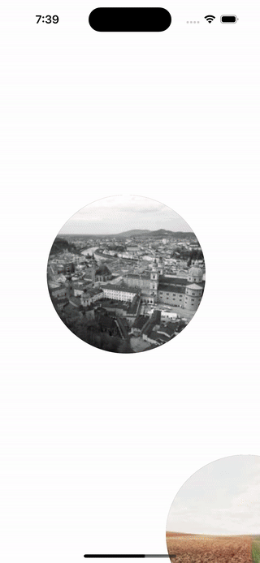

<p align="left">
<a href="https://www.npmjs.com/package/react-native-circle-animation"></a>
<a href="https://www.npmjs.com/package/react-native-circle-animation"></a>
<a href="https://www.npmjs.com/package/react-native-circle-animation"<></a>
</p>

## Preview

#### Example 1<space>&emsp;&emsp;&emsp;&emsp;&emsp;&emsp;&emsp;&emsp;&emsp;&emsp;&emsp;&emsp;&emsp;&emsp;&emsp;&emsp;&emsp;&emsp;&emsp;&emsp;&emsp;  Example 2
&emsp;&emsp;&emsp; 


# react-native-circle-animation


## Getting started

`$ npm i react-native-circle-animation`

### Requirements

#### Before installing `react-native-circle-animation`, it is necessary to install its dependent libraries.

## Steps:

Below are the dependency for this package that you'll need to add to your project. To install, run the following commands:
 
1. `npm i react-native-gesture-handler react-native-reanimated @shopify/flash-list react-native-reanimated-carousel`
2. `Add into babel.config.js file: plugins: ['react-native-reanimated/plugin']`
3. `cd ios && pod install`


## Usage

##### Vertical circle-animation-list 

```javascript

import CircleAnimationList from 'react-native-circle-animation';

  const renderHorizontalSlider = (item, index) => {
    return (
      <View style={styles.container}>
        <View style={styles.circle}>
          <Image style={styles.circle} source={{uri: item.img}} />
        </View>
      </View>
    );
  };

  const onEndReached = () => {
    console.log('=== onEndReached ===');
  };

  const renderFooterLoader = () => {
    console.log('=== renderFooterLoader ===');
  };

  return (
     <View style={{flex: 1}}>
      <CircleAnimationList
        data={verticalArray}
        extraData={true}
        secondArrayName={'horizontalArray'}
        isHorizontalArray={false}
        verticalAnimation={'fast'}
        onEndReached={onEndReached}
        horizontalAnimation={500}
        circleAnimationAtLeftSide={false}
        horizontalSpacingLeftToRightPosition={-50}
        centerObjectLeftToRightPosition={120}
        topObjectUpToDownPosition={15}
        bottomObjectUpToDownPosition={-55}
        horizontalListInLoop={false}
        verticalScrollEnabled={true}
        horizontalScrollEnabled={true}
        marginTopForFirstIndex={300}
        showsVerticalScrollIndicator={false}
        listFooterComponent={renderFooterLoader}
        onEndReachedThreshold={0.0000000001}
        renderItem={(item, index) => renderHorizontalSlider(item, index)}
        verticalListRef={ref => console.log(ref)}
        horizontalListRef={ref => console.log(ref)}
        verticalCurrentIndex={value => console.log('verticalIndex =>', value)}
        horizontalCurrentIndex={value =>
          console.log('horizontalIndex =>', value)
        }
      />
    </View>
  );
}

  const verticalArray = [
    {
      id: 0,
      img: 'https://picsum.photos/200',
    },
    {
      id: 1,
      img: 'https://picsum.photos/200',
    },
    {
      id: 2,
      img: 'https://picsum.photos/200',
    },
    {
      id: 3,
      img: 'https://picsum.photos/200',
    },
    {
      id: 4,
      img: 'https://picsum.photos/200',
    },
    {
      id: 5,
      img: 'https://picsum.photos/200',
    },
  ];

const styles = StyleSheet.create({
  container: {
    alignItems: 'center',
    justifyContent: 'center',
    marginLeft: 100,
    width: 350,
  },
  circle: {
    alignItems: 'center',
    justifyContent: 'center',
    backgroundColor: 'black',
    width: 300,
    height: 300,
    borderRadius: 150,
  },
  txt: {color: 'red', fontSize: 35},
});

```

##### Vertical and Horizontal circle-animation-list

```javascript

import CircleAnimationList from 'react-native-circle-animation';

 const renderHorizontalSlider = (item, index) => {
    return (
        <View style={styles.container}>
        <View style={styles.circle}>
          <Image style={styles.circle} source={{uri: item.img}} />
        </View>
      </View>
    );
  };

  const onEndReached = () => {
    console.log('=== onEndReached ===');
  };

  const renderFooterLoader = () => {
    console.log('=== renderFooterLoader ===');
  };

  return (
    <View style={{flex: 1}}>
      <CircleAnimationList
        data={verticalArray}
        extraData={true}
        secondArrayName={'horizontalArray'}
        isHorizontalArray={true}
        verticalAnimation={'fast'}
        onEndReached={onEndReached}
        horizontalAnimation={500}
        circleAnimationAtLeftSide={false}
        horizontalSpacingLeftToRightPosition={-50}
        centerObjectLeftToRightPosition={120}
        topObjectUpToDownPosition={15}
        bottomObjectUpToDownPosition={-55}
        horizontalListInLoop={false}
        verticalScrollEnabled={true}
        horizontalScrollEnabled={true}
        marginTopForFirstIndex={300}
        showsVerticalScrollIndicator={false}
        listFooterComponent={renderFooterLoader}
        onEndReachedThreshold={0.0000000001}
        renderItem={(item, index) => renderHorizontalSlider(item, index)}
        verticalListRef={ref => console.log(ref)}
        horizontalListRef={ref => console.log(ref)}
        verticalCurrentIndex={value => console.log('verticalIndex =>', value)}
        horizontalCurrentIndex={value =>
          console.log('horizontalIndex =>', value)
        }
      />
    </View>
  );
}

  const verticalArray = [
    {
      id: 0,
      img: 'https://picsum.photos/200',
      horizontalArray: [
        {
          id: 0,
          img: 'https://picsum.photos/200',
        },
        {
          id: 1,
          img: 'https://picsum.photos/200',
        },
        {
          id: 2,
          img: 'https://picsum.photos/200',
        },
      ],
    },
    {
      id: 1,
      img: 'https://picsum.photos/200',
      horizontalArray: [
        {
          id: 0,
          img: 'https://picsum.photos/200',
        },
        {
          id: 1,
          img: 'https://picsum.photos/200',
        },
        {
          id: 2,
          img: 'https://picsum.photos/200',
        },
      ],
    },
    {
      id: 2,
      img: 'https://picsum.photos/200',
      horizontalArray: [
        {
          id: 0,
          img: 'https://picsum.photos/200',
        },
        {
          id: 1,
          img: 'https://picsum.photos/200',
        },
        {
          id: 2,
          img: 'https://picsum.photos/200',
        },
      ],
    },
    {
      id: 3,
      img: 'https://picsum.photos/200',
      horizontalArray: [
        {
          id: 0,
          img: 'https://picsum.photos/200',
        },
        {
          id: 1,
          img: 'https://picsum.photos/200',
        },
        {
          id: 2,
          img: 'https://picsum.photos/200',
        },
      ],
    },
    {
      id: 4,
      img: 'https://picsum.photos/200',
      horizontalArray: [
        {
          id: 0,
          img: 'https://picsum.photos/200',
        },
        {
          id: 1,
          img: 'https://picsum.photos/200',
        },
        {
          id: 2,
          img: 'https://picsum.photos/200',
        },
      ],
    },
    {
      id: 5,
      img: 'https://picsum.photos/200',
      horizontalArray: [
        {
          id: 0,
          img: 'https://picsum.photos/200',
        },
        {
          id: 1,
          img: 'https://picsum.photos/200',
        },
        {
          id: 2,
          img: 'https://picsum.photos/200',
        },
      ],
    },
  ];

const styles = StyleSheet.create({
  container: {
    alignItems: 'center',
    justifyContent: 'center',
    marginLeft: 100,
    width: 350,
  },
  circle: {
    alignItems: 'center',
    justifyContent: 'center',
    backgroundColor: 'black',
    width: 300,
    height: 300,
    borderRadius: 150,
  },
  txt: {color: 'red', fontSize: 35},
});
```

## Note:

There is no any difference between Vertical circle-animation-list and Vertical and Horizontal circle-animation-list.

1. If you want to use only vertical circle-animation-list then you have to set isHorizontalArray property to false.
2. If you want to use both vertical and horizontal animations, you have to set the isHorizontalArray property to true and set the secondArrayName property with your horizontal array list.

## Basic Props

| Props    | Type   | Description                                                                                             | isRequire                         |
|----------|--------|---------------------------------------------------------------------------------------------------------|----------------------------------|
| data    | Array | Provide array to library                                                                                | Yes                         |
| isHorizontalArray     | Boolean | true = vertical & horizontal list, false = only vertical list  | Yes |
| renderItem | Func | Takes an item from data and renders it into the list | Yes |
| secondArrayName | String | This prop renders the horizontal and vertical arrays if you have enabled horizontal animation | No |
| marginTopForFirstIndex | Number | First item spacing from top | No |
| extraData | Boolean | Props it self re-render the list                                                                              | No                |
| verticalAnimation   | String   | This prop for set the scrolling speed using two arguments 'normal' and 'fast'                                                                          | No          |
| onEndReached | Func   | Function is trigger when list reached at bottom  | No                        |
| horizontalAnimation | Number   |  This prop set the horizontal scrolling speed |  No                       |
| horizontalListInLoop | Boolean   |  Horizontal list will work in repeat mode by setting true or false |  No   |
| verticalScrollEnabled | Boolean   | For lock vertical scrolling enable/disable by setting true or false  |      No                   |
| horizontalScrollEnabled | Boolean   | For lock horizontal scrolling enable/disable by setting true or false  |      No                   |
| listFooterComponent | Func   | Footer loader  |      No                   |
| verticalListRef | Func   | This prop returns the vertical list refrence  |      No                   |
| horizontalListRef | Func   | This prop returns the horizontal list refrence  |      No                   |
| verticalCurrentIndex | Func   | This function returns the selected index from the vertical array list  |      No                   |
| horizontalCurrentIndex | Func   | This function returns the selected index from the horizontal array list  |      No                   |
| showsVerticalScrollIndicator | Boolean   | To enable/disable scroll indicator by passing true or false  |      No                 |
| circleAnimationAtLeftSide | Boolean   | This props will flip the scrolling effect  |      No                 |
| horizontalSpacingLeftToRightPosition | Number   | For moving the first and third objects position left to right and vice a versa  |      No                 |
| centerObjectLeftToRightPosition | Number   | For moving the center object's position left to right and vice a versa  |      No                 |
| topObjectUpToDownPosition | Number   | For moving the top object position up or down  |      No                 |
| bottomObjectUpToDownPosition | Number   | For moving the bottom object position up or down  |      No                 |
| onEndReachedThreshold | Number   | This prop represents the number of screen lengths you should be from the bottom before it fires the event  |      No                 |
